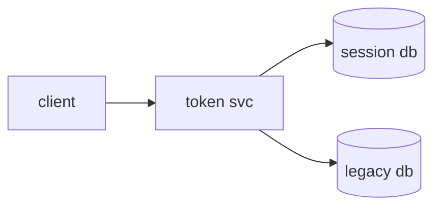

# Auth service migration plan

We're moving session handling off the legacy monolith and onto the new
[token service](https://example.com). This plan covers the cutover in **three
phases**, each with a clean rollback. Target window is the *low-traffic* Sunday
maintenance slot. ~~No downtime~~ minimal downtime.

> [!NOTE]
> Phase 1 ships behind a flag. There is no user-facing change until we flip
> `auth.v2` on in Phase 3.

## Phase 1 — dual-write

Write every new session to **both** the legacy store and the token service.
Reads stay on the legacy path. We verify parity with the `drift-check` job.

### Checklist

- [x] Provision the token service in `us-east-1`
- [x] Ship shadow-write adapter behind `auth.v2.dualwrite`
- [ ] Backfill historical sessions (est. 4h)
- [ ] Wire nightly parity report to `#auth-migration`

### Rollout order

1. Internal staff cohort (~120 users)
2. Beta ring (5% of traffic)
3. General availability

> [!TIP]
> Keep the parity report open during the first GA hour. A drift rate under
> `0.01%` is the green light for Phase 2.

## Phase 2 — cut reads over

| Phase | Action       | Risk   | Rollback         |
|-------|--------------|--------|------------------|
| 1     | Dual-write   | Low    | Disable flag     |
| 2     | Cut reads    | High   | Re-point reads   |
| 3     | Decommission | Medium | Restore snapshot |

> [!WARNING]
> Read cutover is the only step without an instant rollback — re-pointing reads
> takes ~90s to propagate. Do not start within 30 min of a deploy freeze.

### Flip command

```js
// flip the read path for a single cohort, then watch drift
function cutover(cohort) {
  const rate = driftRate(cohort);
  if (rate > 0.0001) return abort("drift too high");
  authctl("flag", "set", "auth.v2.reads", cohort);
}
```

> The legacy store stays warm for 14 days after Phase 3. We do not delete a
> single row until the snapshot has been restored once in staging.

> [!IMPORTANT]
> The on-call rotation must be staffed by someone from the auth team for the
> full GA window. Page `@auth-oncall` directly, not the general SRE channel.

> [!CAUTION]
> Never run `decommission` and `backfill` in the same window — they contend on
> the same replication slot and will deadlock.

## Capacity math

Expected steady-state write load is the session creation rate times the
dual-write factor. Inline: the budget is $QPS = u \cdot r / t$, well under the
provisioned ceiling. Block form:

$$ P_{99} = \frac{\sum_i w_i \lambda_i}{N} \le 8000\ \text{rps} $$

## Topology



---

#### Open questions

Do we keep the legacy `SESSION_SECRET` rotating on the old schedule, or move it
under the token service's KMS key during Phase 2? Owner: **platform-security**.
